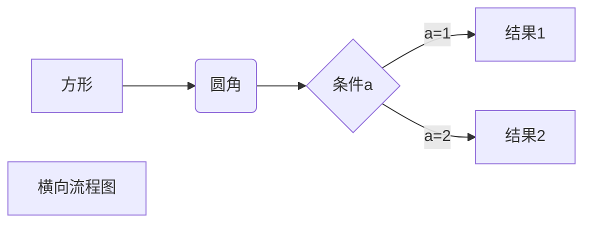
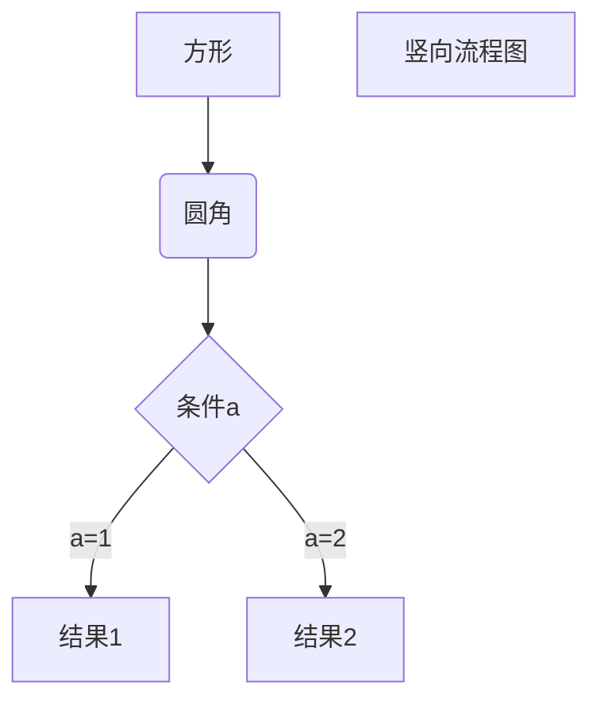
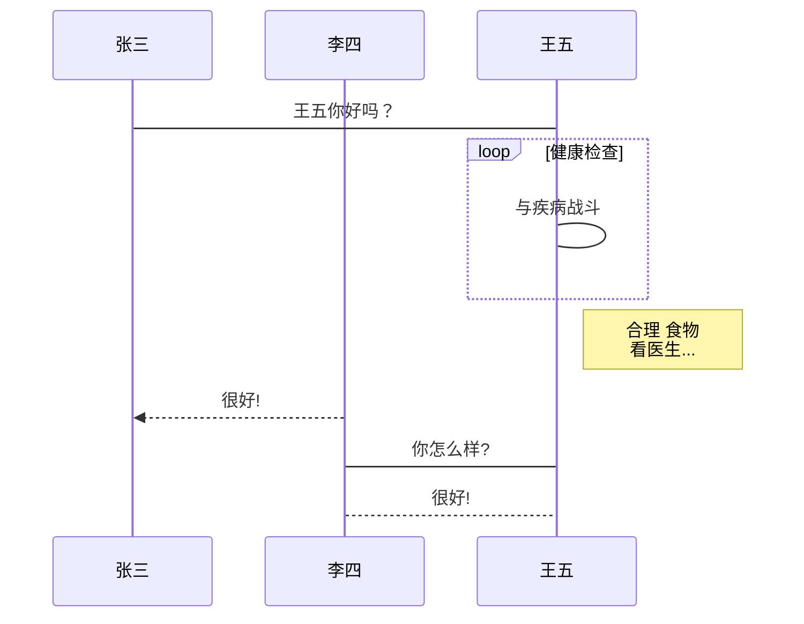
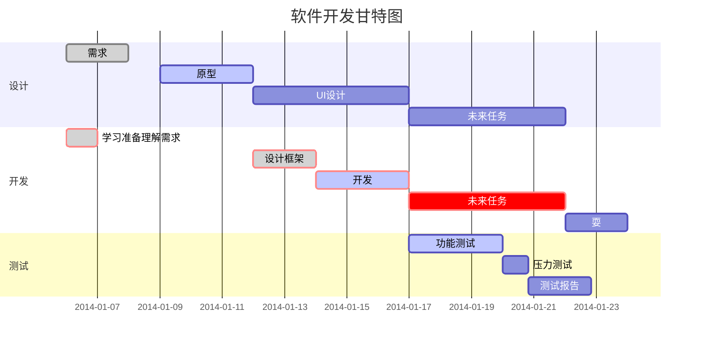

VsCode支持的markdown语法参考
===

## 1. 文本部分

---

### 1.1 斜体和粗体，删除线

使用 * 和 ** 表示斜体和粗体。

示例：这是 *斜体*，这是 **粗体**。

使用 ~~ 表示删除线。
~~这是一段错误的文本。~~

### 1.2 分级标题

使用 === 表示一级标题，使用 --- 表示二级标题。

你也可以选择在行首加井号表示不同级别的标题 (H1-H6)，例如：

# H1

## H2

### H3

#### H4

### 1.3 常用 Emoji & Font-Awesome

||a| b| c |d |e| f|
|------|-----|------|------|------|------|------|
|1|:punch: |:notebook:| :e-mail:| :smile:| :movie_camera: |:camera:|
|2|:fa-car:| :telephone_receiver:| :phone:| :heart:| :alarm_clock:| :loop:|
|3|:+1:| :books:| :email:| :-1:| :bulb:| :hammer:|
|4|:rocket:| :book:| :envelope:| :sunny:| :mag_right: |:chart_with_upwards_trend:|
|5|:cloud:| :bar_chart:| :wind_chime:| :hibiscus:| :paperclip: |:ghost:|
|6|:bug:| :date:| :balloon: |:beers:| :guitar: |:headphones:|
|7|:rice:| :guitar:| :mortar_board:| :house: |:mount_fuji:| :office:|
|8|:rocket:| :school: |:cupid:| :notes: |:shit:| :feet:|
|9|:speech_balloon:|
更多emoji:  <https://www.webfx.com/tools/emoji-cheat-sheet/>

### 1.4 引用和注脚

使用 [^keyword] 表示注脚。

标注

- 上标：30^th^
- 下标：H~2~O
- 脚注：Content [^1]
[^1]:Hi 这里是一个注脚，会自动拉到最后面排版

缩略：

*[HTML]:超文本标记语言
*[W3C]:World Wide Web Consortium
The HTML specification
is maintained by the W3C.

这里要有空格隔开中文
*[月]:yue4
*[辍]:chuo4
明 明 如 月，何 时 可 辍

标记
==marked==

### 1.5 外链接

这是去往 [百度](http://www.baidu.com)的链接。
我的邮箱：[siriusing.cc@qq.com](siriusing.cc@qq.com)

### 1.6 文字引用

使用 > 表示文字引用。

示例：

> 野火烧不尽，春风吹又生。

### 1.7 内容目录

在段落中填写 [TOC] 以显示全文内容的目录结构。

 [TOC]

## 2. 标签分类
在编辑区任意行的列首位置输入以下代码给文稿标签：

标签： 数学 英语 Markdown
Tags： 数学 英语 Markdown

### 2.0 常用布局

### 2.1 无序列表

使用 *，+，- 表示无序列表。

- 无序列表项 一
- 无序列表项 二
- 无序列表项 三

### 2.2 有序列表

使用数字和点表示有序列表。

1. 有序列表项 一
2. 有序列表项 二
3. 有序列表项 三

### 2.3 行内代码块

使用 `代码` 表示行内代码块。

示例：

让我们聊聊 html。

tips:只要在左边做一个tab缩进就可以变成代码块
    这是一个代码块，此行左侧有四个不可见的空格。

    这是一个代码块，此行左侧有四个不可见的空格。

### 2.4 插入图像

使用  插入图像。

### 2.5 表格支持

| 项目        | 价格   |  数量  |
| --------   | -----:  | :----:  |
| 计算机     | \$1600 |   5     |
| 手机        |   \$12   |   12   |
| 管线        |    \$1    |  234  |
| > | ce    |   ce|

|a|b|
|---|---|
|>|1|
|2||

### 2.6 定义型列表

名词 1
:   定义 1（左侧有一个可见的冒号和四个不可见的空格）

代码块 2
:    这是代码块的定义（左侧有一个可见的冒号和四个不可见的空格）

        代码块（左侧有八个不可见的空格）

### 2.7 Html 标签

本站支持在 Markdown 语法中嵌套 Html 标签，譬如，你可以用 Html 写一个纵跨两行的表格：
设置colspan，rowspan

<table>
    <tr>
        <th rowspan="2">值班人员</th>
        <th>星期一</th>
        <th>星期二</th>
       <th>星期三</th>
    </tr>
    <tr>
        <td>李强</td>
        <td>张明</td>
        <td>王平</td>
    </tr>
</table>
### 2.8 待办事宜 Todo 列表
使用带有 [ ] 或 [x] （未完成或已完成）项的列表语法撰写一个待办事宜列表，并且支持子列表嵌套以及混用Markdown语法，例如：
- [ ] **七月旅行准备**
    - [ ] 准备1
    - [ ] 浏览
    - [x] 蓝宝石公主号到[船票](https://www.baidu.com)
        - [ ] 2000 rmb
        - [ ] 两个人
---
Hi 这里是一个注脚，会自动拉到最后面排版 ↩
```java {.line-numbers}

// submit 调用的是execute
public <T> Future<T> submit(Callable<T> task) {
if (task == null) throw new NullPointerException();
RunnableFuture<T> ftask = newTaskFor(task);
execute(ftask);
return ftask;
}
```
---
## 5. 各种图
### 5.1、横向流程图源码格式：



### 5.2、竖向流程图源码格式：



### 5.3、标准流程图源码格式：

```flow
st=>start: 开始框
op=>operation: 处理框
cond=>condition: 判断框(是或否?)
sub1=>subroutine: 子流程
io=>inputoutput: 输入输出框
e=>end: 结束框
st->op->cond
cond(yes)->io->e
cond(no)->sub1(right)->op
```

### 5.4、标准流程图源码格式（横向）：

```flow
st=>start: 开始框
op=>operation: 处理框
cond=>condition: 判断框(是或否?)
sub1=>subroutine: 子流程
io=>inputoutput: 输入输出框
e=>end: 结束框
st(right)->op(right)->cond
cond(yes)->io(bottom)->e
cond(no)->sub1(right)->op
```

### 5.5、UML时序图源码样例：

```sequence
对象A->对象B: 对象B你好吗?（请求）
Note right of 对象B: 对象B的描述
Note left of 对象A: 对象A的描述(提示)
对象B-->对象A: 我很好(响应)
对象A->对象B: 你真的好吗？
```

### 5.6、UML时序图源码复杂样例：

```sequence
Title: 标题：复杂使用
对象A->对象B: 对象B你好吗?（请求）
Note right of 对象B: 对象B的描述
Note left of 对象A: 对象A的描述(提示)
对象B-->对象A: 我很好(响应)
对象B->小三: 你好吗
小三-->>对象A: 对象B找我了
对象A->对象B: 你真的好吗？
Note over 小三,对象B: 我们是朋友
participant C
Note right of C: 没人陪我玩
```

### 5.7、UML标准时序图样例：



### 5.8、甘特图样例：


